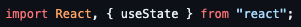
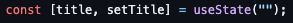
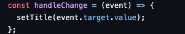
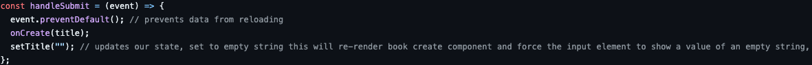
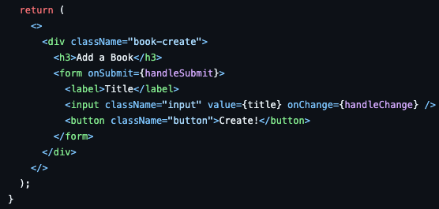
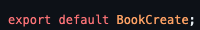

# How it works 

## First Component: <code>BookCreate</code>

This code defines a React functional component named <code>BookCreate</code> that provides a form to create a new book title. Let's break down its functionality:

### Import Statements 

 

This code imports the necessary modules for React to render the component and its state.

### State Initialization

 

 
Initializes a state variable <code>title</code> using the <code>useState</code> hook. It holds the current value of the book's title being input by the user. The <code>setTitle</code> function updates the title state.

### Handling Input Change

 

 
Defines <code>handleChange</code>, a function that triggers when the input field value changes. It updates the title state with the new value entered into the input field.

### Handling Form Submission

 

 
<code>handleSubmit</code> is called when the form is submitted. It prevents the default form submission behavior (page refresh) using <code>event.preventDefault()</code>. 

 
It invokes the <code>onCreate</code> function (passed as a prop) and passes the <code>title</code> as an argument. This function presumably handles the creation of a new book with the given title. After submission, it resets the title state to an empty string using <code>setTitle("")</code>, effectively clearing the input field for a new entry.

### Component Rendering (JSX)

 

 
The return statement contains the JSX that renders the component. It displays a form with a label "Title", an input field that is bound to the title state through the value attribute, and an <code>onChange</code> event handler that triggers <code>handleChange</code> when the input value changes.

 
It displays a div element with the class name "book-create", a h3 heading "Add a Book", and a form with an input field for entering the book title. The input field's value is bound to the title state through the value attribute, and the <code>onChange</code> event triggers handleChange to update the title state.

 
There's also a "Create!" button within the form that triggers the handleSubmit function upon clicking.

### Exporting the Component

 

 
This exports the <code>BookCreatet</code> component as the default export, allowing it to be imported and used in other parts of the application.

 

<b>Next, we can now move on to the <code>BookList</code> component breakdown, head over to <code>BookList.md</code> file to continue reading about each component.</b>
