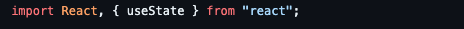
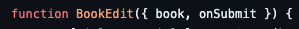
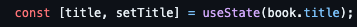
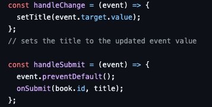
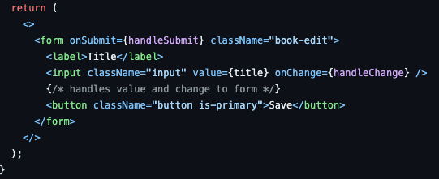
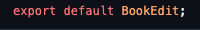

# How it works 

## Fourth Component: <code>BookEdit</code>

This code defines a React functional component named <code>BookEdit</code> that serves to edit book titles. Let's break down its functionality:

### Import Statements

 

This code imports the necessary modules for React and the <code>useState</code> hook used to manage state within a functional component.

### Function Declaration

 

 
This declares the functional component <code>BookEdit</code> which takes two props: <code>book</code> (an object representing a book) and <code>onSubmit</code> (a function to handle form submission).

### State Hook

 

 
This line uses the <code>useState</code> hook to create a state variable <code>title</code> and its corresponding updater function <code>setTitle</code>. The initial value of <code>title</code> is set to the <code>book.title</code>, which is the title of the book passed as a prop.

### Event Handling Functions

 

 
<code>handleChange</code> is a function triggered when the input field's value changes. It updates the <code>title</code> state with the new value from the input field.

 
<code>handleSubmit</code> is called when the form is submitted. It prevents the default form submission behavior and invokes the <code>onSubmit</code> prop, passing the book's ID and the updated title as arguments.

### Component JSX

 

 

The return statement renders the JSX for the component. It consists of a form with an input field for editing the book title and a "Save" button. The value attribute of the input field is bound to the <code>title</code> state, and the <code>onChange</code> event triggers the <code>handleChange</code> function.

In summary, this <code>BookEdit</code> component provides a form interface to edit book titles. It displays the current title in an input field and allows users to modify it. When the form is submitted, it triggers the <code>onSubmit</code> function, passing the updated title and the book's ID to handle the submission logic elsewhere in the application.

### Exporting the Component

 

 
This exports the <code>BookEdit</code> component as the default export, allowing it to be imported and used in other parts of the application.

