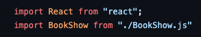
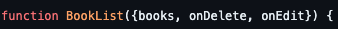
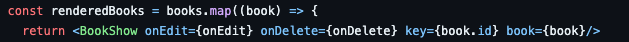
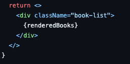
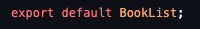

# How it works 
This code defines a React functional component named <code>BookList</code> that renders a list of books using the <code>BookShow</code> component for each individual book.

Let's break it down step by step:

## Second Component: <code>BookList</code>

### Import Statements

 

This code imports the necessary modules for React to render the component. 

### Function Declaration

 

 
This declares the functional component <code>BookList</code> which takes three props: books (an array of book objects), <code>onDelete</code> (a function to delete a book), and <code>onEdit</code> (a function to edit a book).

### Mapping Books to BookShow Component

 

 
The map function is used on the books array to iterate through each book.
For each book, it creates a <code>BookShow</code> component, passing the <code>onEdit</code> and <code>onDelete</code> functions as props, along with the key prop set to the book's unique id and the book object itself.

### Component Rendering (JSX)

 

 
The return statement contains the JSX that renders the component.
It displays a "div" </code>
</code> element with the class name "book-list" that contains the <code>renderedBooks</code> array, which consists of <code>BookShow</code> components for each book.

### Exporting the Component

 

 
This exports the <code>BookList</code> component as the default export, allowing it to be imported and used in other parts of the application.

 
In summary, the <code>BookList</code> component takes in an array of book objects (books), <code>onDelete</code>, and <code>onEdit</code> functions as props. It iterates through the books array using map and generates a <code>BookShow</code> component for each book, passing the necessary props. Finally, it renders these components within a div with the class name "book-list", effectively displaying a list of books using the <code>BookShow</code> component for each book entry.

 

<b>Next, we can now move on to the <code>BookShow</code> component breakdown, head over to <code>BookShow.md</code> file to continue reading about each component.</b>
