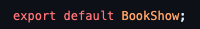

# How it works

## Third Component: <code>BookShow</code>

This code defines a React functional component named <code>BookShow</code>. Let's break down its functionality:

### Import Statements 

 

This code imports the necessary modules for React and another component named <code>BookEdit</code> from a local file.

### Function Declaration

 

This declares the functional component BookShow which takes three props: <code>book</code>, <code>onDelete</code>, and <code>onEdit</code>.

### State Hook

 

This line uses the <code>useState</code> hook to create a state variable <code>showEdit</code> and its corresponding updater function <code>setShowEdit</code>. The initial value of <code>showEdit</code> is set to false.

### Event Handling Functions

 

<code>handleEditClick</code> toggles the value of showEdit when the "Edit" button is clicked. <code>handleSubmit</code> is a callback function passed to the <code>BookEdit</code> component. It sets <code>showEdit</code> to false and invokes the <code>onEdit</code> prop with the book's id and the new title. 

 
<code>handleDeleteClick</code> invokes the onDelete prop with the book's id when the "Delete" button is clicked.

### Conditional Rendering

 

 

This section defines a variable content that initially contains an element displaying the book's title. If <code>showEdit</code> is true, it replaces the content variable with the <code>BookEdit</code> component, passing the <code>handleSubmit</code> function and the book prop.

<h3><b>Component JSX</b></h3>

 

 

The return statement renders the JSX for the component. It includes an image, the content variable (either an or the <code>BookEdit</code> component), and two buttons for "Edit" and "Delete" with corresponding click event handlers.

In summary, this component renders a book with its title, an image, and options to edit or delete. The editing functionality is handled by the <code>BookEdit</code> component, and the state of whether to show the edit form is managed by the <code>showEdit</code> state variable.

### Exporting the Component

 

 
This exports the <code>BookShow</code> component as the default export, allowing it to be imported and used in other parts of the application.

 

<b>Next, we can now move on to the <code>BookEdit</code> component breakdown, head over to <code>BookEdit.md</code> file to continue reading about each component.</b>

